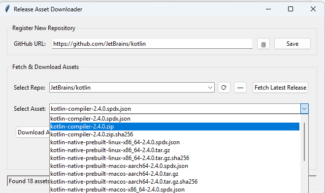

# Release Asset Downloader

A python tkinter based cross-platform GUI utility to download release assets from a Github repository.

Simply paste and save the Github repo URL. Fetch latest release asset. Download asset!

To install,
 - run `pip install git+https://github.com/2ashishs/py-release-asset-downloader` OR
 - clone the repo, `cd` into the repo directory and type `pip install .`

To run, execute `rad` on the command-line.

